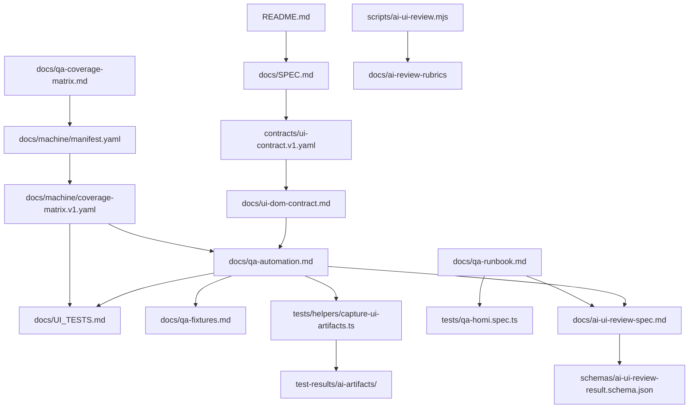

# Homi v1 기계 판독 참조 맵

작성일: 2026-03-06  
목표: SPEC/계약/QA/자동화/스키마 문서의 의존 순서를 기계 판독 관점으로 일관 추적한다.  
원칙: 참조는 단방향으로만 기록한다.

## 1) 핵심 오브젝트 (정렬된 인덱스)

- `README.md` (non-contract)
- `docs/SPEC.md` (authoritative spec)
- `contracts/ui-contract.v1.yaml` (machine contract registry)
- `docs/ui-dom-contract.md` (DOM/testid machine-first contract)
- `docs/qa-automation.md` (Playwright 계약 스펙)
- `docs/UI_TESTS.md` (수동 체크리스트)
- `docs/qa-runbook.md` (실행 표준)
- `docs/qa-fixtures.md` (테스트 픽스처 규약)
- `docs/qa-coverage-matrix.md` (커버리지 매트릭스)
- `docs/machine/manifest.yaml` (전체 아티팩트/읽기 순서/우선순위 메타)
- `docs/machine/coverage-matrix.v1.yaml` (기계 판독용 커버리지 모델)
- `docs/ai-ui-review-spec.md` (AI 리뷰 계약)
- `schemas/ai-ui-review-result.schema.json`
- `schemas/homi-bundle.v1.schema.json`
- `schemas/dataset-payload.v1.schema.json`
- `schemas/dataset.v1.schema.json`
- `schemas/store.v1.schema.json`
- `schemas/engines/dictation.item.v1.schema.json`
- `schemas/engines/schedule.item.v1.schema.json`
- `scripts/ai-ui-review.mjs`
- `tests/qa-homi.spec.ts`
- `tests/helpers/capture-ui-artifacts.ts`
- `tests/fixtures/bundle.min.v1.json`
- `tests/fixtures/bundle.xss.v1.json`
- `docs/ai-review-rubrics/home.default.md`
- `docs/ai-review-rubrics/backup.overlay.md`
- `docs/ai-review-rubrics/dictation.running.md`
- `docs/ai-review-rubrics/schedule.toast.during-dictation.md`
- `docs/ai-review-rubrics/shared.md`
- `docs/TASK.md`

## 2) 참조 간선 (from → to : relation)

```json
{
  "version": "1",
  "nodes": [
    "README.md",
    "docs/SPEC.md",
    "contracts/ui-contract.v1.yaml",
    "docs/ui-dom-contract.md",
    "docs/qa-automation.md",
    "docs/UI_TESTS.md",
    "docs/qa-runbook.md",
    "docs/qa-fixtures.md",
    "docs/qa-coverage-matrix.md",
    "docs/machine/manifest.yaml",
    "docs/machine/coverage-matrix.v1.yaml",
    "docs/ai-ui-review-spec.md",
    "schemas/ai-ui-review-result.schema.json",
    "schemas/homi-bundle.v1.schema.json",
    "schemas/dataset-payload.v1.schema.json",
    "schemas/dataset.v1.schema.json",
    "schemas/store.v1.schema.json",
    "schemas/engines/dictation.item.v1.schema.json",
    "schemas/engines/schedule.item.v1.schema.json",
    "scripts/ai-ui-review.mjs",
    "scripts/write-version.mjs",
    "tests/qa-homi.spec.ts",
    "tests/helpers/capture-ui-artifacts.ts",
    "tests/fixtures/bundle.min.v1.json",
    "tests/fixtures/bundle.xss.v1.json",
    "docs/ai-review-rubrics/home.default.md",
    "docs/ai-review-rubrics/backup.overlay.md",
    "docs/ai-review-rubrics/dictation.running.md",
    "docs/ai-review-rubrics/schedule.toast.during-dictation.md",
    "docs/ai-review-rubrics/shared.md",
    "docs/TASK.md",
    "package.json"
  ],
  "edges": [
    {
      "from": "README.md",
      "to": ["docs/SPEC.md", "docs/TASK.md", "docs/qa-automation.md", "docs/UI_TESTS.md", "docs/ui-dom-contract.md", "docs/qa-runbook.md", "docs/qa-coverage-matrix.md", "docs/qa-fixtures.md", "contracts/ui-contract.v1.yaml", "schemas/", "docs/machine/manifest.yaml", "docs/ai-ui-review-spec.md"],
      "relation": "references"
    },
    {
      "from": "docs/SPEC.md",
      "to": ["contracts/ui-contract.v1.yaml", "schemas/homi-bundle.v1.schema.json", "schemas/dataset-payload.v1.schema.json", "schemas/dataset.v1.schema.json", "schemas/store.v1.schema.json"],
      "relation": "dependsOn"
    },
    {
      "from": "contracts/ui-contract.v1.yaml",
      "to": ["docs/ui-dom-contract.md", "docs/SPEC.md"],
      "relation": "implementsFrom (commentary)"
    },
    {
      "from": "docs/ui-dom-contract.md",
      "to": ["contracts/ui-contract.v1.yaml", "docs/qa-automation.md", "docs/UI_TESTS.md"],
      "relation": "dependsOn"
    },
    {
      "from": "docs/qa-automation.md",
      "to": ["contracts/ui-contract.v1.yaml", "docs/ui-dom-contract.md", "docs/qa-fixtures.md", "docs/UI_TESTS.md", "docs/qa-runbook.md", "../scripts/ai-ui-review.mjs", "../docs/ai-review-rubrics/home.default.md", "../docs/ai-review-rubrics/backup.overlay.md", "../docs/ai-review-rubrics/dictation.running.md", "../docs/ai-review-rubrics/schedule.toast.during-dictation.md", "schemas/ai-ui-review-result.schema.json"],
      "relation": "dependsOn"
    },
    {
      "from": "docs/UI_TESTS.md",
      "to": ["docs/SPEC.md", "docs/ui-dom-contract.md", "docs/qa-automation.md", "docs/qa-runbook.md", "docs/qa-fixtures.md"],
      "relation": "references"
    },
    {
      "from": "docs/qa-runbook.md",
      "to": ["docs/UI_TESTS.md", "docs/qa-automation.md", "tests/qa-homi.spec.ts", "docs/qa-fixtures.md", "docs/qa-coverage-matrix.md", "docs/machine/coverage-matrix.v1.yaml", "docs/SPEC.md", "docs/TASK.md"],
      "relation": "runStandardFor"
    },
    {
      "from": "docs/qa-fixtures.md",
      "to": ["tests/fixtures/bundle.min.v1.json", "tests/fixtures/bundle.xss.v1.json", "schemas/homi-bundle.v1.schema.json", "schemas/dataset-payload.v1.schema.json", "schemas/dataset.v1.schema.json", "schemas/store.v1.schema.json", "docs/qa-automation.md", "docs/UI_TESTS.md", "docs/qa-runbook.md"],
      "relation": "dependsOn"
    },
    {
      "from": "docs/qa-coverage-matrix.md",
      "to": ["docs/machine/coverage-matrix.v1.yaml", "docs/machine/manifest.yaml", "docs/qa-automation.md", "docs/UI_TESTS.md", "contracts/ui-contract.v1.yaml", "tests/qa-homi.spec.ts"],
      "relation": "governanceMatrix"
    },
    {
      "from": "docs/machine/manifest.yaml",
      "to": ["README.md", "docs/SPEC.md", "contracts/ui-contract.v1.yaml", "schemas/homi-bundle.v1.schema.json", "schemas/dataset-payload.v1.schema.json", "schemas/dataset.v1.schema.json", "schemas/store.v1.schema.json", "schemas/ai-ui-review-result.schema.json", "schemas/engines/dictation.item.v1.schema.json", "schemas/engines/schedule.item.v1.schema.json", "docs/qa-automation.md", "docs/ai-ui-review-spec.md", "docs/UI_TESTS.md", "docs/qa-runbook.md", "docs/qa-fixtures.md", "docs/qa-coverage-matrix.md", "docs/ui-dom-contract.md", "docs/ai-review-rubrics/home.default.md", "docs/ai-review-rubrics/backup.overlay.md", "docs/ai-review-rubrics/dictation.running.md", "docs/ai-review-rubrics/schedule.toast.during-dictation.md", "docs/ai-review-rubrics/shared.md", "docs/TASK.md", "docs/machine/coverage-matrix.v1.yaml", "src/lib/homi.ts", "src/App.svelte", "tests/qa-homi.spec.ts"],
      "relation": "artifactIndex"
    },
    {
      "from": "docs/machine/coverage-matrix.v1.yaml",
      "to": ["docs/UI_TESTS.md", "docs/qa-automation.md", "docs/qa-coverage-matrix.md", "docs/machine/manifest.yaml", "tests/qa-homi.spec.ts", "docs/SPEC.md", "contracts/ui-contract.v1.yaml", "schemas/dataset.v1.schema.json", "schemas/dataset-payload.v1.schema.json", "schemas/homi-bundle.v1.schema.json", "schemas/store.v1.schema.json"],
      "relation": "mapsTo"
    },
    {
      "from": "docs/ai-ui-review-spec.md",
      "to": ["docs/qa-automation.md", "contracts/ui-contract.v1.yaml", "docs/ui-dom-contract.md", "schemas/ai-ui-review-result.schema.json", "docs/ai-review-rubrics/home.default.md", "docs/ai-review-rubrics/backup.overlay.md", "docs/ai-review-rubrics/dictation.running.md", "docs/ai-review-rubrics/schedule.toast.during-dictation.md", "docs/ai-review-rubrics/shared.md"],
      "relation": "dependsOn"
    },
    {
      "from": "schemas/dataset-payload.v1.schema.json",
      "to": ["schemas/engines/dictation.item.v1.schema.json", "schemas/engines/schedule.item.v1.schema.json"],
      "relation": "$ref"
    },
    {
      "from": "schemas/dataset.v1.schema.json",
      "to": ["schemas/engines/dictation.item.v1.schema.json", "schemas/engines/schedule.item.v1.schema.json"],
      "relation": "$ref"
    },
    {
      "from": "schemas/homi-bundle.v1.schema.json",
      "to": ["schemas/dataset-payload.v1.schema.json"],
      "relation": "$ref"
    },
    {
      "from": "schemas/store.v1.schema.json",
      "to": ["schemas/dataset.v1.schema.json"],
      "relation": "$ref"
    },
    {
      "from": "scripts/ai-ui-review.mjs",
      "to": ["docs/ai-review-rubrics/", "schemas/ai-ui-review-result.schema.json", "docs/ai-ui-review-spec.md", "test-results/ai-artifacts/", "test-results/ai-reviews/"],
      "relation": "runtimeDependencies"
    },
    {
      "from": "package.json",
      "to": ["scripts/ai-ui-review.mjs", "tests/qa-homi.spec.ts", "docs/ai-review-rubrics/"],
      "relation": "npmScriptReferences"
    },
    {
      "from": "tests/qa-homi.spec.ts",
      "to": ["tests/helpers/capture-ui-artifacts.ts"],
      "relation": "imports"
    },
    {
      "from": "tests/helpers/capture-ui-artifacts.ts",
      "to": ["test-results/ai-artifacts/"],
      "relation": "writesArtifact"
    },
    {
      "from": "docs/ai-review-rubrics/home.default.md",
      "to": ["docs/ai-ui-review-spec.md", "scripts/ai-ui-review.mjs"],
      "relation": "reviewRubric"
    },
    {
      "from": "docs/ai-review-rubrics/backup.overlay.md",
      "to": ["docs/ai-ui-review-spec.md", "scripts/ai-ui-review.mjs"],
      "relation": "reviewRubric"
    },
    {
      "from": "docs/ai-review-rubrics/dictation.running.md",
      "to": ["docs/ai-ui-review-spec.md", "scripts/ai-ui-review.mjs"],
      "relation": "reviewRubric"
    },
    {
      "from": "docs/ai-review-rubrics/schedule.toast.during-dictation.md",
      "to": ["docs/ai-ui-review-spec.md", "scripts/ai-ui-review.mjs"],
      "relation": "reviewRubric"
    },
    {
      "from": "docs/ai-review-rubrics/shared.md",
      "to": ["docs/ai-ui-review-spec.md", "scripts/ai-ui-review.mjs"],
      "relation": "reviewRubric"
    },
    {
      "from": "docs/TASK.md",
      "to": ["docs/ui-dom-contract.md", "docs/qa-automation.md", "docs/qa-coverage-matrix.md", "docs/machine/coverage-matrix.v1.yaml", "docs/UI_TESTS.md"],
      "relation": "progress"
    }
  ]
}
```

## 3) 핵심 경로 (요약)

### 경로 A: 규격의 정합성 경로
`docs/SPEC.md` -> `contracts/ui-contract.v1.yaml` -> `docs/ui-dom-contract.md` -> `docs/qa-automation.md` -> `docs/UI_TESTS.md`

### 경로 B: 실행 검증 경로
`README.md` -> `docs/qa-runbook.md` -> `tests/qa-homi.spec.ts` -> `tests/helpers/capture-ui-artifacts.ts` -> `test-results/ai-artifacts/`

### 경로 C: AI 리뷰 경로
`docs/qa-automation.md` -> `docs/ai-ui-review-spec.md` -> `docs/ai-review-rubrics/*` -> `scripts/ai-ui-review.mjs` -> `schemas/ai-ui-review-result.schema.json`

## 4) Mermaid 참조 그래프 (요약)



## 5) 점검 포인트(자동/수동 확인용)

- `docs/qa-automation.md`, `docs/ui-dom-contract.md`, `docs/qa-coverage-matrix.md`의 `dependencies`와 실제 링크가 불일치하지 않는지 확인한다.
- `docs/machine/manifest.yaml`의 `truthOrder`와 `machineReadModel`이 구현/실행 코드 경로(`src`/`tests`)와 맞는지 주기적으로 점검한다.
- `schemas/*`의 `$ref` 체인이 실제 엔진 item 스키마까지 닿는지 확인한다.
- `scripts/ai-ui-review.mjs`와 `package.json`의 `qa:ai-review` 옵션이 `docs/ai-ui-review-spec.md`의 계약(artifact 경로, schema, rubrics)과 정합되는지 검증한다.
